# 🏗️ Arquitetura de Workflows N8N — CRM Brasileiros no Atacama

> Documento de referência para validação antes da implementação.
> Cada workflow é independente, organizado por função, e a IA do N8N terá acesso completo a todo o CRM.

---

## 📡 Mapa Completo de APIs do CRM

Estes são **todos os 47 endpoints** que o N8N pode chamar via `http://crm:8000` + Header `X-API-Key`.

### 👤 Leads (8 endpoints)
| # | Método | Endpoint | O que faz | Payload |
|---|---|---|---|---|
| 1 | `GET` | `/api/leads` | Listar leads | `?search=&destino=&status_venda=&skip=0&limit=100` |
| 2 | `GET` | `/api/leads/{id}` | Detalhes de 1 lead | — |
| 3 | `POST` | `/api/leads` | **Criar lead** | `{nome, email, whatsapp, destinos[], data_chegada, data_partida, status_venda, campos_personalizados{}}` |
| 4 | `PUT` | `/api/leads/{id}` | **Atualizar lead** | Mesmos campos do POST (parcial) |
| 5 | `DELETE` | `/api/leads/{id}` | Deletar lead | — |
| 6 | `POST` | `/api/leads/import` | Importar CSV/Excel | `multipart/form-data` |
| 7 | `GET` | `/api/leads/destinos` | Listar destinos disponíveis | — |
| 8 | `GET` | `/api/leads/segment` | Segmentação inline | `?destino=&status_venda=&tag_id=&data_chegada_de=&data_chegada_ate=` |

### 🏷️ Tags (6 endpoints)
| # | Método | Endpoint | O que faz | Payload |
|---|---|---|---|---|
| 9 | `GET` | `/api/tags` | Listar tags | `?search=&skip=0&limit=100` |
| 10 | `GET` | `/api/tags/{id}` | Detalhes de 1 tag | — |
| 11 | `POST` | `/api/tags` | Criar tag | `{nome, cor}` |
| 12 | `PUT` | `/api/tags/{id}` | Atualizar tag | `{nome, cor}` |
| 13 | `DELETE` | `/api/tags/{id}` | Deletar tag | — |
| 14 | `PUT` | `/api/tags/lead/{lead_id}` | **Definir tags do lead** | `{tag_ids: [1, 2, 3]}` |
| 15 | `GET` | `/api/tags/lead/{lead_id}` | Ver tags do lead | — |

### 📊 Pipeline / Funil (10 endpoints)
| # | Método | Endpoint | O que faz | Payload |
|---|---|---|---|---|
| 16 | `GET` | `/api/pipeline/funnels` | Listar funis | — |
| 17 | `GET` | `/api/pipeline/funnels/{id}` | Detalhes do funil | — |
| 18 | `POST` | `/api/pipeline/funnels` | Criar funil | `{nome, descricao, etapas[{id, nome}]}` |
| 19 | `PUT` | `/api/pipeline/funnels/{id}` | Atualizar funil | `{nome, descricao, etapas[]}` |
| 20 | `DELETE` | `/api/pipeline/funnels/{id}` | Deletar funil | — |
| 21 | `GET` | `/api/pipeline/board/{funnel_id}` | **Kanban board completo** | — |
| 22 | `POST` | `/api/pipeline/funnels/{id}/leads` | **Adicionar lead ao funil** | `{lead_id, etapa_id}` |
| 23 | `PUT` | `/api/pipeline/entries/{entry_id}/move` | **Mover lead de etapa** | `{etapa_id}` |
| 24 | `POST` | `/api/pipeline/entries/{entry_id}/transfer` | **Transferir entre funis** | `{target_funnel_id, target_etapa_id}` |
| 25 | `DELETE` | `/api/pipeline/entries/{entry_id}` | Remover do funil | — |
| 26 | `GET` | `/api/pipeline/history/{lead_id}` | **Histórico completo** | — |
| 27 | `POST` | `/api/pipeline/history/{lead_id}/note` | **Adicionar nota** | `{descricao, dados{}}` |

### ✅ Tarefas (4 endpoints)
| # | Método | Endpoint | O que faz | Payload |
|---|---|---|---|---|
| 28 | `GET` | `/api/tasks` | Listar tarefas | `?status=&tipo=&due_date=&overdue=true&skip=0&limit=100` |
| 29 | `POST` | `/api/tasks` | **Criar tarefa** | `{title, description, data_vencimento, lead_id, user_id, tipo}` |
| 30 | `PUT` | `/api/tasks/{id}` | Atualizar tarefa | `{title, status, data_vencimento}` |
| 31 | `DELETE` | `/api/tasks/{id}` | Deletar tarefa | — |

### 🎯 Segmentação (6 endpoints)
| # | Método | Endpoint | O que faz | Payload |
|---|---|---|---|---|
| 32 | `GET` | `/api/segments` | Listar segmentos salvos | — |
| 33 | `GET` | `/api/segments/{id}` | Detalhes do segmento | — |
| 34 | `POST` | `/api/segments` | **Criar segmento** | `{nome, rules{destino, status_venda, tag_ids[], data_chegada_de, data_chegada_ate}}` |
| 35 | `PUT` | `/api/segments/{id}` | Atualizar segmento | `{nome, rules{}}` |
| 36 | `DELETE` | `/api/segments/{id}` | Deletar segmento | — |
| 37 | `GET` | `/api/segments/{id}/leads` | **Leads do segmento** | `?skip=0&limit=100` |
| 38 | `POST` | `/api/segments/preview` | **Preview de filtros** | `{destino, status_venda, tag_ids[], ...}` |

### 👥 Equipes (6 endpoints)
| # | Método | Endpoint | O que faz | Payload |
|---|---|---|---|---|
| 39 | `GET` | `/api/teams` | Listar equipes | — |
| 40 | `POST` | `/api/teams` | Criar equipe | `{nome, descricao, cor}` |
| 41 | `GET` | `/api/teams/{id}` | Detalhes da equipe | — |
| 42 | `PUT` | `/api/teams/{id}` | Atualizar equipe | `{nome, descricao, cor}` |
| 43 | `DELETE` | `/api/teams/{id}` | Deletar equipe | — |
| 44 | `POST` | `/api/teams/{id}/members` | **Definir membros** | `{user_ids: [1, 2]}` |

### 📈 Analytics (2 endpoints)
| # | Método | Endpoint | O que faz | Payload |
|---|---|---|---|---|
| 45 | `GET` | `/api/analytics/dashboard` | **KPIs + gráfico** | `?start_date=&end_date=` |
| 46 | `GET` | `/api/analytics/reports` | **Relatórios detalhados** | `?start_date=&end_date=` |

### 🔧 Sistema (1 endpoint)
| # | Método | Endpoint | O que faz |
|---|---|---|---|
| 47 | `GET` | `/api/health` | Health check |

---

## 🧠 Workflows — Visão Geral

```mermaid
graph LR
    subgraph "📥 ENTRADA"
        W1["WF-01<br/>Webhook Router"]
    end
    
    subgraph "👤 CAPTAÇÃO"
        W2["WF-02<br/>Novo Lead"]
        W3["WF-03<br/>Qualificação"]
    end
    
    subgraph "💬 ATENDIMENTO"
        W4["WF-04<br/>Menu Interativo"]
        W5["WF-05<br/>Atendente IA"]
    end
    
    subgraph "📊 GESTÃO"
        W6["WF-06<br/>Funil Automático"]
    end
    
    subgraph "⏰ AUTOMAÇÃO"
        W7["WF-07<br/>Follow-up"]
        W8["WF-08<br/>Tarefas"]
        W9["WF-09<br/>Relatório Diário"]
    end
    
    subgraph "📢 MARKETING"
        W10["WF-10<br/>Campanha em Massa"]
    end
    
    W1 -->|"Lead novo"| W2
    W1 -->|"Lead existente"| W4
    W2 --> W3
    W3 --> W6
    W4 -->|"Texto livre"| W5
    W4 -->|"Alterar dados"| W3
    W5 --> W6
```



---

## 📋 Detalhamento dos Workflows

---

### WF-01: Webhook Router (Porta de Entrada)

**Trigger:** Webhook POST do WhatsApp (Meta Cloud API)
**Frequência:** Real-time (cada mensagem recebida)

**Objetivo:** Recebe TODAS as mensagens e roteia para o workflow certo.

```
📥 Webhook WhatsApp
    │
    ├─ Extrair: telefone, mensagem, tipo_mensagem, timestamp
    │
    ├─ 🔍 HTTP Request: GET /api/leads?search={telefone}
    │
    ├─ ❓ IF: lead existe?
    │   ├─ NÃO → Chamar WF-02 (Novo Lead)
    │   └─ SIM → Chamar WF-04 (Menu Interativo)
    │
    └─ 🛡️ Validar assinatura X-Hub-Signature-256
```

**APIs usadas:**
| Endpoint | Finalidade |
|---|---|
| `GET /api/leads?search={telefone}` | Verifica se o contato já é lead |

---

### WF-02: Novo Lead (Captação Automática)

**Trigger:** Chamado pelo WF-01 (Sub-workflow)
**Frequência:** Cada novo contato

**Objetivo:** Cria lead, tageia, coloca no funil, envia boas-vindas.

```
📞 Dados do novo contato
    │
    ├─ 📝 HTTP Request: POST /api/leads
    │   Body: {nome: "Lead WhatsApp", whatsapp: telefone, status_venda: "novo"}
    │
    ├─ 🏷️ HTTP Request: PUT /api/tags/lead/{lead_id}
    │   Body: {tag_ids: [ID_TAG_WHATSAPP]}
    │
    ├─ 📊 HTTP Request: POST /api/pipeline/funnels/1/leads
    │   Body: {lead_id: id, etapa_id: "nova_oportunidade"}
    │
    ├─ 📜 HTTP Request: POST /api/pipeline/history/{lead_id}/note
    │   Body: {descricao: "Lead captado via WhatsApp"}
    │
    ├─ 💬 WhatsApp API: Enviar mensagem de boas-vindas
    │
    └─ ➡️ Chamar WF-03 (Qualificação)
```

**APIs usadas:**
| Endpoint | Finalidade |
|---|---|
| `POST /api/leads` | Criar o lead |
| `PUT /api/tags/lead/{id}` | Adicionar tag "WhatsApp" |
| `POST /api/pipeline/funnels/{id}/leads` | Colocar no funil |
| `POST /api/pipeline/history/{id}/note` | Registrar evento |

---

### WF-03: Qualificação (Coleta de Dados)

**Trigger:** Chamado pelos WF-02 ou WF-04 (Sub-workflow)
**Frequência:** Cada lead novo ou que pede pra alterar dados

**Objetivo:** Faz perguntas sequenciais via WhatsApp e atualiza o lead.

```
🎯 Início da qualificação
    │
    ├─ 💬 Perguntar: "Qual seu nome completo?"
    │   └─ 📝 PUT /api/leads/{id} → {nome: resposta}
    │
    ├─ 💬 Perguntar: "Qual destino?" (botões: Atacama | Uyuni | Salar)
    │   └─ 📝 PUT /api/leads/{id} → {destinos: [resposta]}
    │
    ├─ 💬 Perguntar: "Quando pretende viajar?" 
    │   └─ 📝 PUT /api/leads/{id} → {data_chegada: resposta}
    │
    ├─ 💬 Perguntar: "Quantas pessoas?"
    │   └─ 📝 PUT /api/leads/{id} → {campos_personalizados: {pessoas: N}}
    │
    ├─ 💬 Perguntar: "Qual seu email?"
    │   └─ 📝 PUT /api/leads/{id} → {email: resposta}
    │
    ├─ 📊 PUT /api/pipeline/entries/{entry_id}/move
    │   Body: {etapa_id: "contato_feito"}
    │
    └─ 📜 POST /api/pipeline/history/{id}/note
        Body: {descricao: "Qualificação completa via WhatsApp"}
```

**APIs usadas:**
| Endpoint | Finalidade |
|---|---|
| `PUT /api/leads/{id}` | Atualizar cada dado coletado |
| `PUT /api/pipeline/entries/{id}/move` | Avançar etapa no funil |
| `POST /api/pipeline/history/{id}/note` | Registrar conclusão |

---

### WF-04: Menu Interativo (Roteador de Conversa)

**Trigger:** Chamado pelo WF-01 quando lead já existe (Sub-workflow)
**Frequência:** Cada mensagem de lead existente

**Objetivo:** Analisa a mensagem e direciona pra ação correta.

```
💬 Mensagem do lead existente
    │
    ├─ 🔍 HTTP Request: GET /api/leads/{id}
    │   → Carrega dados completos do lead
    │
    ├─ 🧠 Switch (análise da mensagem):
    │
    │   ├─ Contém "menu" / "ajuda" / "oi" / "olá"
    │   │   └─ 💬 WhatsApp: Enviar menu com botões:
    │   │       ├─ 📋 "Ver minha viagem"
    │   │       ├─ 💬 "Falar com assistente"
    │   │       ├─ 📅 "Alterar dados"
    │   │       └─ 📞 "Falar com humano"
    │   │
    │   ├─ Botão "Ver minha viagem"
    │   │   ├─ GET /api/pipeline/history/{id}
    │   │   └─ 💬 Enviar: "Nome: X, Destino: Y, Data: Z, Status: W"
    │   │
    │   ├─ Botão "Alterar dados"
    │   │   └─ ➡️ Chamar WF-03 (Qualificação)
    │   │
    │   ├─ Botão "Falar com humano"
    │   │   ├─ POST /api/tasks → {title: "Atender lead via WhatsApp", lead_id}
    │   │   └─ 💬 Enviar: "Um atendente vai falar com você em breve!"
    │   │
    │   └─ Texto livre (qualquer outra mensagem)
    │       └─ ➡️ Chamar WF-05 (Atendente IA)
```

**APIs usadas:**
| Endpoint | Finalidade |
|---|---|
| `GET /api/leads/{id}` | Buscar dados do lead |
| `GET /api/pipeline/history/{id}` | Buscar histórico |
| `POST /api/tasks` | Criar tarefa para atendente humano |

---

### WF-05: Atendente IA (AI Agent)

**Trigger:** Chamado pelo WF-04 para mensagens de texto livre (Sub-workflow)
**Frequência:** Cada mensagem sem intenção específica

**Objetivo:** IA conversa com o lead, qualifica, e atualiza o CRM automaticamente.

```
🧠 AI Agent (Gemini/Claude)
    │
    ├─ 📥 CONTEXTO INJETADO:
    │   ├─ GET /api/leads/{id} → dados do lead
    │   ├─ GET /api/pipeline/history/{id} → histórico
    │   └─ GET /api/tags/lead/{id} → tags atuais
    │
    ├─ 🤖 SYSTEM PROMPT:
    │   "Você é Bia, especialista de vendas da Brasileiros no Atacama.
    │    Lead: {nome}, destinos: {destinos}, status: {status}.
    │    Responda de forma natural. Qualifique o lead.
    │    Você tem acesso a Tools para atualizar o CRM."
    │
    ├─ 🔧 TOOLS DO AI AGENT (o que a IA pode chamar):
    │   │
    │   ├─ 🔍 buscar_lead
    │   │   → GET /api/leads/{id}
    │   │
    │   ├─ ✏️ atualizar_lead
    │   │   → PUT /api/leads/{id}
    │   │   Body: {nome, email, whatsapp, destinos, data_chegada, data_partida, campos_personalizados}
    │   │
    │   ├─ 🏷️ definir_tags
    │   │   → PUT /api/tags/lead/{id}
    │   │   Body: {tag_ids: [...]}
    │   │
    │   ├─ 📊 mover_no_funil
    │   │   → PUT /api/pipeline/entries/{entry_id}/move
    │   │   Body: {etapa_id: "em_negociacao"}
    │   │
    │   ├─ 📜 adicionar_nota
    │   │   → POST /api/pipeline/history/{id}/note
    │   │   Body: {descricao: "..."}
    │   │
    │   ├─ ✅ criar_tarefa
    │   │   → POST /api/tasks
    │   │   Body: {title, description, data_vencimento, lead_id}
    │   │
    │   ├─ 📋 listar_destinos
    │   │   → GET /api/leads/destinos
    │   │
    │   ├─ 🔎 buscar_historico
    │   │   → GET /api/pipeline/history/{id}
    │   │
    │   └─ 📈 ver_analytics
    │       → GET /api/analytics/dashboard
    │
    ├─ 💬 WhatsApp API: Enviar resposta da IA
    │
    └─ 📜 POST /api/pipeline/history/{id}/note
        Body: {descricao: "IA: [resumo da conversa]"}
```

> [!IMPORTANT]
> Este é o workflow mais poderoso. O AI Agent tem acesso a **9 ferramentas** que cobrem leitura e escrita em leads, tags, funil, tarefas e analytics. A IA decide sozinha quando usar cada tool.

**APIs usadas pelo AI Agent:**
| Tool | Endpoint | Ação |
|---|---|---|
| `buscar_lead` | `GET /api/leads/{id}` | Consultar dados |
| `atualizar_lead` | `PUT /api/leads/{id}` | Alterar dados do lead |
| `definir_tags` | `PUT /api/tags/lead/{id}` | Gerenciar tags |
| `mover_no_funil` | `PUT /api/pipeline/entries/{id}/move` | Avançar/retroceder etapa |
| `adicionar_nota` | `POST /api/pipeline/history/{id}/note` | Registrar anotação |
| `criar_tarefa` | `POST /api/tasks` | Criar tarefa pra equipe |
| `listar_destinos` | `GET /api/leads/destinos` | Consultar destinos |
| `buscar_historico` | `GET /api/pipeline/history/{id}` | Ver histórico do lead |
| `ver_analytics` | `GET /api/analytics/dashboard` | Ver métricas |

---

### WF-06: Funil Automático (Gestão de Pipeline)

**Trigger:** Cron — a cada 2 horas
**Frequência:** 12x por dia

**Objetivo:** Aplica regras automáticas no funil com base em tempo e atividade.

```
⏰ Cron (a cada 2h)
    │
    ├─ 📊 GET /api/pipeline/board/{funnel_id}
    │   → Carrega todo o Kanban
    │
    ├─ 🔄 Para cada lead na etapa "nova_oportunidade":
    │   ├─ SE criado há mais de 48h sem interação:
    │   │   ├─ PUT /api/pipeline/entries/{id}/move → {etapa_id: "follow_up"}
    │   │   ├─ POST /api/tasks → {title: "Follow-up: {nome}"}
    │   │   └─ POST /api/pipeline/history/{id}/note → "Movido automaticamente para follow-up"
    │   │
    │   └─ SE criado há mais de 7 dias:
    │       ├─ PUT /api/pipeline/entries/{id}/move → {etapa_id: "perda"}
    │       └─ PUT /api/leads/{id} → {status_venda: "perda"}
    │
    ├─ 🔄 Para cada lead na etapa "proposta_enviada":
    │   └─ SE sem resposta há mais de 5 dias:
    │       ├─ POST /api/tasks → {title: "Cobrar resposta: {nome}"}
    │       └─ POST /api/pipeline/history/{id}/note → "Tarefa de cobrança criada"
    │
    └─ 📜 Log: "Funil processado: X leads movidos, Y tarefas criadas"
```

**APIs usadas:**
| Endpoint | Finalidade |
|---|---|
| `GET /api/pipeline/board/{id}` | Carregar Kanban completo |
| `PUT /api/pipeline/entries/{id}/move` | Mover leads |
| `POST /api/tasks` | Criar tarefas automáticas |
| `POST /api/pipeline/history/{id}/note` | Registrar movimentações |
| `PUT /api/leads/{id}` | Atualizar status |

---

### WF-07: Follow-up Automático

**Trigger:** Cron — todo dia às 10:00
**Frequência:** 1x por dia

**Objetivo:** Envia mensagem de acompanhamento para leads sem resposta.

```
⏰ Cron (10:00)
    │
    ├─ 🔍 GET /api/leads?status_venda=em_negociacao
    │   → Busca leads em negociação
    │
    ├─ 🔄 Para cada lead com WhatsApp:
    │   ├─ GET /api/pipeline/history/{id}
    │   │   → Verifica última interação
    │   │
    │   ├─ SE última interação > 3 dias:
    │   │   ├─ 💬 WhatsApp: "Oi {nome}! Tudo bem? Vi que você se interessou por {destino}..."
    │   │   └─ POST /api/pipeline/history/{id}/note → "Follow-up automático enviado"
    │   │
    │   └─ SE última interação > 7 dias (2º follow-up):
    │       ├─ 💬 WhatsApp: "Última chance! Temos vagas para {destino} em {data}..."
    │       └─ PUT /api/tags/lead/{id} → adicionar tag "follow_up_2"
```

**APIs usadas:**
| Endpoint | Finalidade |
|---|---|
| `GET /api/leads` | Buscar leads em negociação |
| `GET /api/pipeline/history/{id}` | Verificar última interação |
| `POST /api/pipeline/history/{id}/note` | Registrar envio |
| `PUT /api/tags/lead/{id}` | Tagear leads |

---

### WF-08: Notificações de Tarefas

**Trigger:** Cron — todo dia às 08:00
**Frequência:** 1x por dia

**Objetivo:** Avisa o admin sobre tarefas do dia e atrasadas.

```
⏰ Cron (08:00)
    │
    ├─ 📋 GET /api/tasks?overdue=true
    │   → Tarefas atrasadas
    │
    ├─ 📋 GET /api/tasks?due_date={hoje}
    │   → Tarefas de hoje
    │
    ├─ ✍️ Montar mensagem:
    │   "📋 BOM DIA! Resumo de tarefas:
    │    ⚠️ 3 tarefas ATRASADAS
    │    📅 5 tarefas para HOJE
    │    
    │    Atrasadas:
    │    - [Lead João] Follow-up (venceu 20/04)
    │    - [Lead Maria] Enviar proposta (venceu 19/04)
    │    
    │    Hoje:
    │    - [Lead Pedro] Confirmar viagem
    │    - [Lead Ana] Enviar voucher"
    │
    └─ 💬 WhatsApp/Email: Enviar para admin
```

**APIs usadas:**
| Endpoint | Finalidade |
|---|---|
| `GET /api/tasks?overdue=true` | Tarefas atrasadas |
| `GET /api/tasks?due_date={hoje}` | Tarefas do dia |

---

### WF-09: Relatório Diário

**Trigger:** Cron — todo dia às 19:00
**Frequência:** 1x por dia

**Objetivo:** Envia resumo do dia com métricas e destaques.

```
⏰ Cron (19:00)
    │
    ├─ 📈 GET /api/analytics/dashboard?start_date={hoje}&end_date={hoje}
    │   → KPIs do dia
    │
    ├─ 📈 GET /api/analytics/reports?start_date={inicio_mes}&end_date={hoje}
    │   → Acumulado do mês
    │
    ├─ 📊 GET /api/pipeline/board/1
    │   → Estado atual do funil
    │
    ├─ ✍️ Montar relatório:
    │   "📊 RELATÓRIO DO DIA {data}
    │    
    │    📥 Novos leads: 5
    │    💰 Vendas fechadas: 2
    │    📈 Taxa conversão: 12.5%
    │    ⏳ Tarefas pendentes: 3
    │    
    │    📊 Funil:
    │    - Nova Oportunidade: 8 leads
    │    - Contato Feito: 12 leads
    │    - Em Negociação: 6 leads
    │    - Proposta Enviada: 3 leads
    │    - Venda: 2 leads
    │    
    │    🏆 Acumulado do mês: 15 vendas"
    │
    └─ 💬 WhatsApp/Email: Enviar para admin
```

**APIs usadas:**
| Endpoint | Finalidade |
|---|---|
| `GET /api/analytics/dashboard` | KPIs do dia |
| `GET /api/analytics/reports` | Relatório detalhado |
| `GET /api/pipeline/board/{id}` | Estado do funil |

---

### WF-10: Campanha em Massa (Template Messages)

**Trigger:** Manual (admin dispara pelo N8N)
**Frequência:** Sob demanda

**Objetivo:** Envia mensagem template aprovada para um segmento de leads.

```
▶️ Trigger Manual (com inputs):
    │ - Segmento: {segment_id} ou filtros inline
    │ - Template WhatsApp: {template_name}
    │ - Variáveis: {var1, var2}
    │
    ├─ 🎯 GET /api/segments/{segment_id}/leads
    │   → Lista de leads do segmento
    │
    ├─ 🏷️ POST /api/tags → Criar tag da campanha (ex: "campanha_julho_2026")
    │
    ├─ 🔄 Para cada lead com WhatsApp:
    │   │
    │   ├─ ⏱️ Wait: 1 segundo (respeitar rate limit)
    │   │
    │   ├─ 💬 WhatsApp API: Enviar template
    │   │   {to: lead.whatsapp, template: template_name, variables: [var1, var2]}
    │   │
    │   ├─ 🏷️ PUT /api/tags/lead/{lead_id}
    │   │   → Adicionar tag da campanha
    │   │
    │   └─ 📜 POST /api/pipeline/history/{lead_id}/note
    │       → "Campanha '{template_name}' enviada"
    │
    └─ 📊 Resumo: "Campanha enviada para X de Y leads"
```

**APIs usadas:**
| Endpoint | Finalidade |
|---|---|
| `GET /api/segments/{id}/leads` | Buscar leads do segmento |
| `POST /api/tags` | Criar tag da campanha |
| `PUT /api/tags/lead/{id}` | Tagear leads da campanha |
| `POST /api/pipeline/history/{id}/note` | Registrar envio |

---

## 📊 Resumo — APIs por Workflow

| Workflow | Endpoints usados | Tipo |
|---|---|---|
| **WF-01** Webhook Router | 1 | Gateway |
| **WF-02** Novo Lead | 4 | Captação |
| **WF-03** Qualificação | 3 | Captação |
| **WF-04** Menu Interativo | 3 | Atendimento |
| **WF-05** Atendente IA | **9 (via Tools)** | Atendimento |
| **WF-06** Funil Automático | 5 | Gestão |
| **WF-07** Follow-up | 4 | Automação |
| **WF-08** Notificações | 2 | Automação |
| **WF-09** Relatório Diário | 3 | Relatórios |
| **WF-10** Campanha | 4 | Marketing |

---

## 🔧 Ordem de Implementação

| Fase | Workflows | Precisa de WhatsApp? |
|---|---|---|
| **1 - Testar agora** | WF-08 (Tarefas) + WF-09 (Relatório) | ❌ Não |
| **2 - Testar agora** | WF-06 (Funil Automático) | ❌ Não |
| **3 - Precisa WhatsApp** | WF-01 (Router) + WF-02 (Novo Lead) | ✅ Sim |
| **4 - Precisa WhatsApp** | WF-04 (Menu) + WF-05 (IA) | ✅ Sim |
| **5 - Precisa WhatsApp** | WF-03 (Qualificação) + WF-07 (Follow-up) | ✅ Sim |
| **6 - Precisa WhatsApp** | WF-10 (Campanha) | ✅ Sim |
